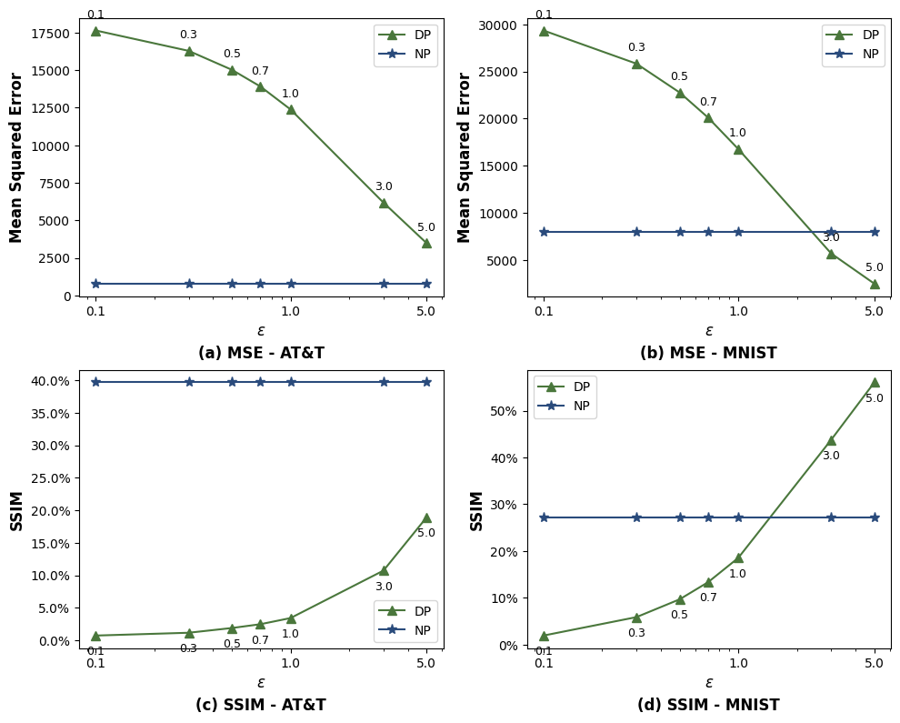
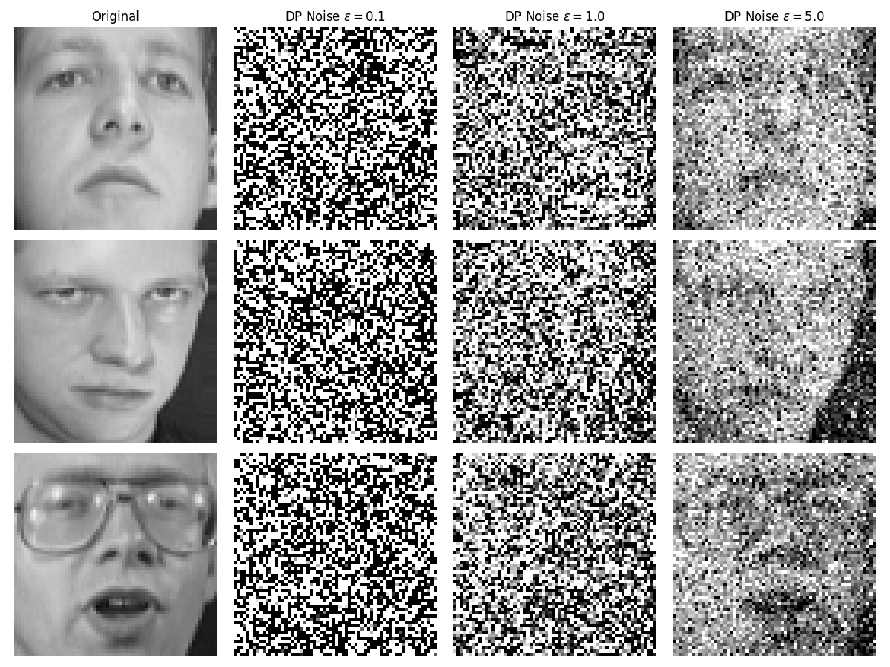
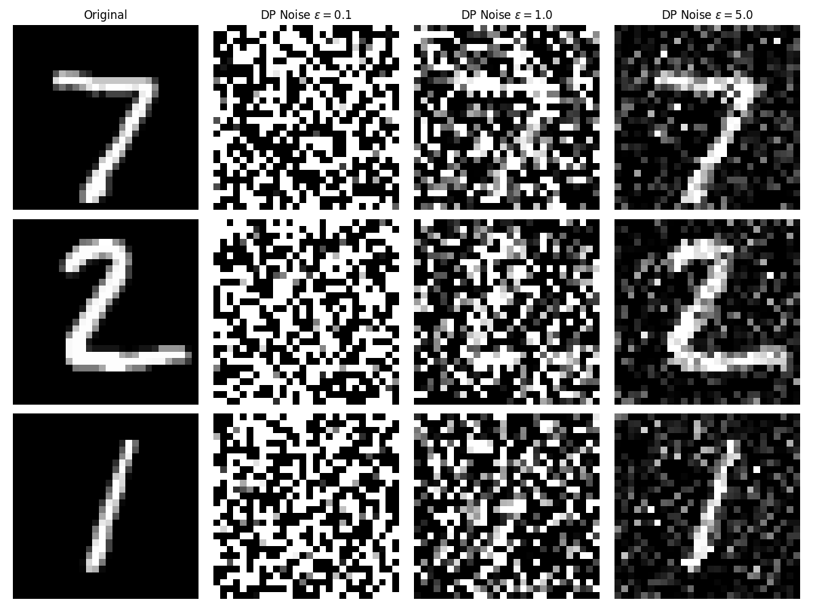

# Face De-Identification, Attacks, and Defenses
## Report Draft

### Team Contributions
- **[Name 1]**: [Role/Contribution]
- **[Name 2]**: [Role/Contribution]

### Phase 2: Attack Results
Baseline and obfuscated test sets evaluation across datasets.

*No data available*

### Phase 3: Differential Privacy Defense Results
Evaluating impact of Laplacian noise on metrics and model accuracy across datasets.

| Dataset   |   Epsilon |      MSE |       SSIM |   Top1_Acc |   Top5_Acc |
|:----------|----------:|---------:|-----------:|-----------:|-----------:|
| AT&T      |       0.1 | 17646.2  | 0.00721333 |        2.5 |      11.25 |
| AT&T      |       0.3 | 16289.4  | 0.0115451  |        2.5 |      15    |
| AT&T      |       0.5 | 15027.9  | 0.0188175  |        2.5 |      12.5  |
| AT&T      |       0.7 | 13918    | 0.0246567  |        2.5 |      12.5  |
| AT&T      |       1   | 12390.4  | 0.0341211  |        2.5 |      12.5  |
| AT&T      |       3   |  6184.58 | 0.107091   |        2.5 |      15    |
| AT&T      |       5   |  3480.93 | 0.189087   |        2.5 |      12.5  |
| MNIST     |       0.1 | 29345.6  | 0.0191937  |       10   |      48    |
| MNIST     |       0.3 | 25829.7  | 0.0586176  |       10   |      46    |
| MNIST     |       0.5 | 22773    | 0.0966827  |       10   |      47    |
| MNIST     |       0.7 | 20113    | 0.133289   |       10   |      48    |
| MNIST     |       1   | 16784.4  | 0.185243   |       10   |      48.5  |
| MNIST     |       3   |  5709.23 | 0.437811   |       17.5 |      72.5  |
| MNIST     |       5   |  2507.55 | 0.560655   |       62.5 |      90.5  |

### Visualizations

#### Combined DP vs NP Metrics Plot (Phase 3)

#### Phase 1: Baseline De-Identification Visualizations

#### Phase 2: Attack Visualizations (Original vs Obfuscated Predictions)

#### Phase 3: DP Noise Visualizations

